class: center, middle

.large-image[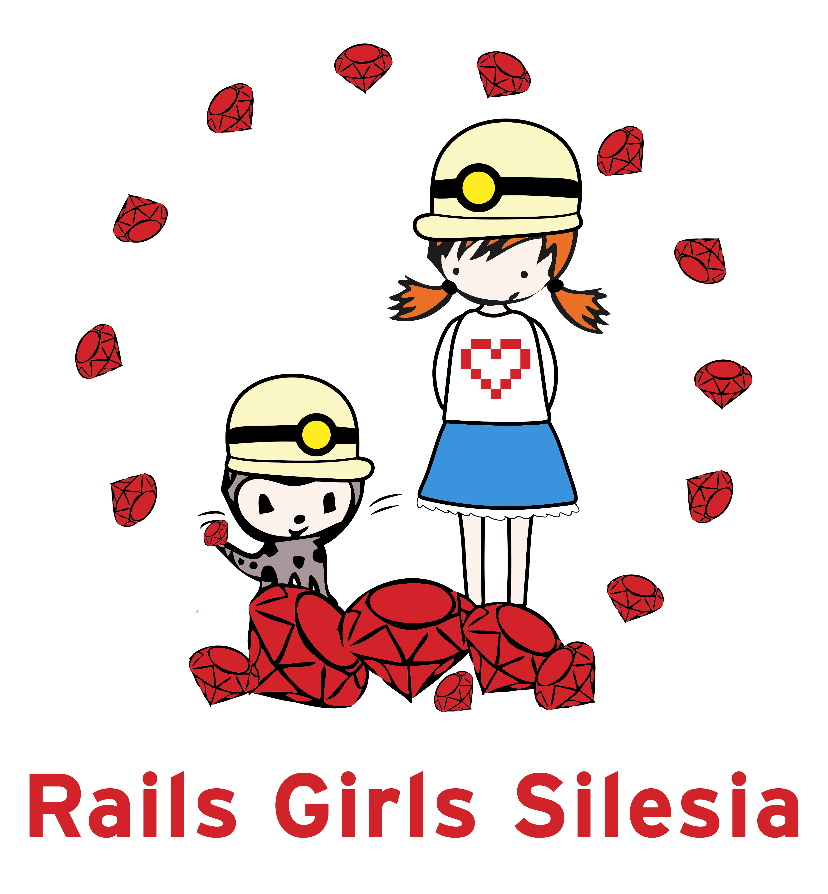]
### Agnieszka Matysek

???

- Rails Girls Coach
- organizatorka RG Silesia
- aktywnie uczestniczy w GGC, WiT, SRUG, itd.
- pracuje jako programistka Rails
- stara się prowadzić bloga

---

class: center, middle, inverse

# How it started?

---

class: center, middle, inverse

# Linda Liukas & Karri Saarinen

.thumb-image[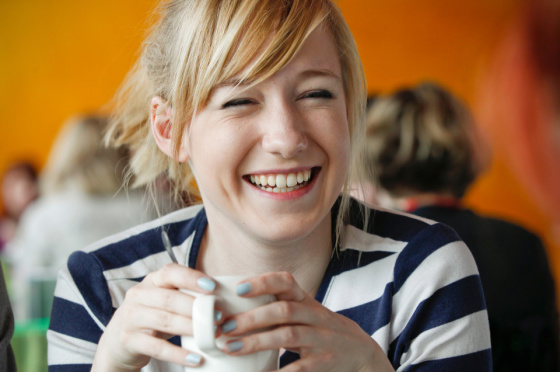]
.thumb-image[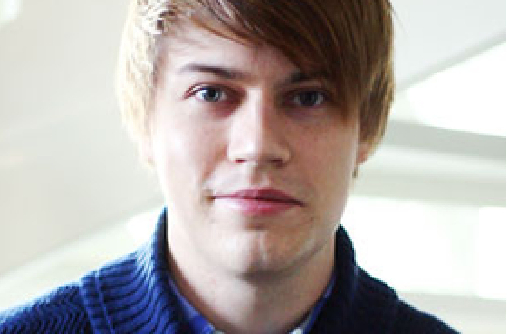]

### Helsinki, Finland in November 2010
#### over 100 interested girls

???

- założyciele: .strong[Linda Liukas], .strong[Karri Saarinen]
- Finlandia państwo: MySQL, SSH, IRC, Linux, Nokia
- wszystko tworzone przez mężczyzn
- kraj równości - prezydent kobieta
- postanowili to zmienić, zmobilizować kobiety do działania
- pierwsze warsztaty: Helsinki, Finlandia, 2010
- pierwsze w Polsce: Kraków, 2012

- warsztaty na całym świecie
- obecnie około .strong[240] warsztatów
- Polska: Kraków, Wrocław, Warszawa, Poznań, Szczecin, Łódź, .strong[Silesia]

---

class: inverse

# Mission

.left-column[
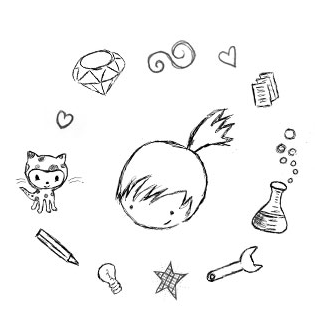
]

.right-column[
- aim to open up for new technology
- make IT more approachable
- free and open event to all enthusiastic girls and women
- build the capacity of knowledge
- shows the right tools
- support for women
- friendly environment to work
- small groups with coach
- fun
]

???

- otwartość na nowe technologie
- IT bardziej przystępne
- warsztaty otwarte dla wszystkich entuzjastek
- budowanie potencjału wiedzy
- pokazanie odpowiednich narzędzi
- wspieranie kobiet
- przyjazne środowisko pracy
- małe grupy z mentorem
- dobra zabawa

- zachęcenie do programowania
- nie tylko używanie ale .strong[tworzenie] Internetu
- całkowicie od podstaw
- dla osób bez doświadczenia
- panowie chcą być częścią warsztatów - jest to możliwe

---

class: center, middle

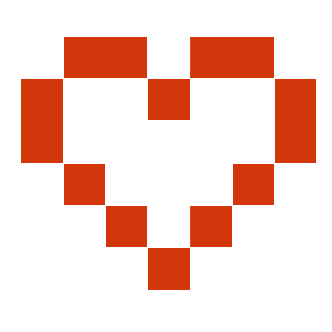
# How it started for me?

---

class: center, middle

# Rails Girls Poznan

.huge-image[]

---

class: center, middle

# Rails Girls Warsaw

.huge-image[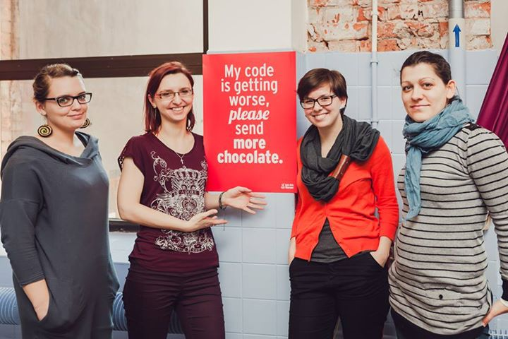]

---

class: center, middle

# Rails Girls Krakow

.huge-image[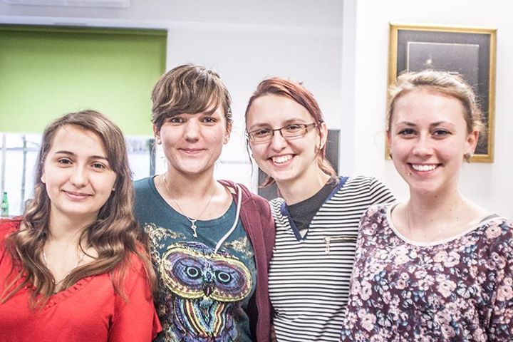]

---

class: center, middle

# Rails Girls Silesia

.huge-image[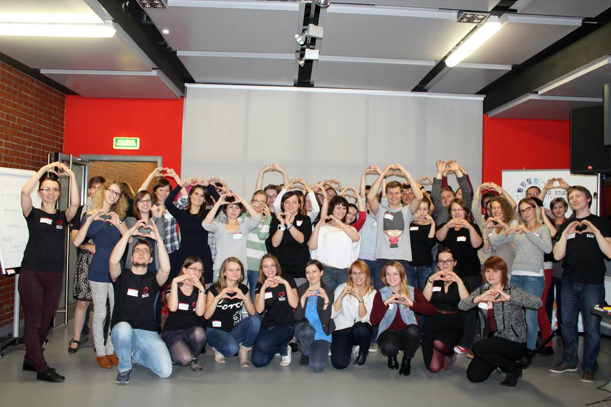]

---

class: inverse

.left-column[
.labs[]
]

.right-column[
# Statistics

- 115 application
- 30 participants
- 10 couches
- 10 organizers
- 16 sponsors
- 14 partners
- 7 speakers
]

---

class: center, inverse

# Saturday Friday hug ;]

.huge-image[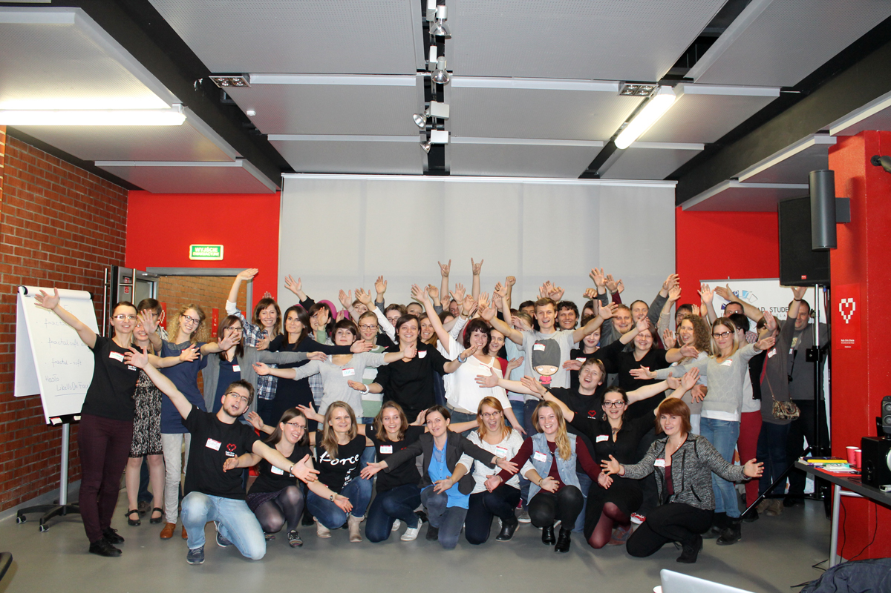]

???

- co to jest Friday hug?

---

class: center, inverse

# Lightning Talks

.huge-image[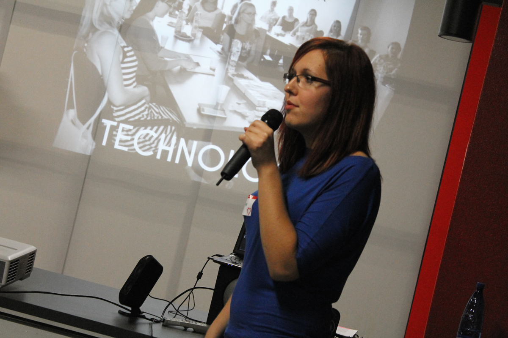]

???

- Dorota - GGC
- Adam - CoderDojo
- Marlena Women in Technology

- Basia (Webmuses) - Adventures? Make You Late for Dinner
- Michał - Komunikacja IT
- Zofia - MOOC
- Alek - Praca w zespole

---

class: center, inverse

# Hard work

.huge-image[]

???

- co robiły dziewczyny?

---

class: center, inverse

# Fun

.huge-image[]

---

class: center, inverse

# Lots of food!

.huge-image[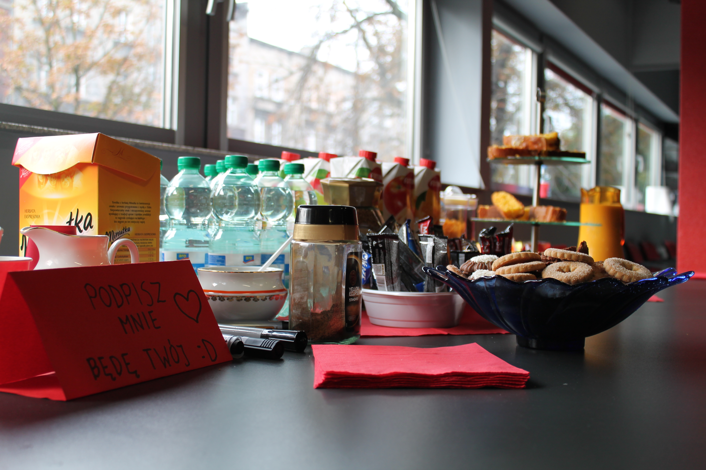]

---

class: inverse

# .center[What next?]

.huge-image[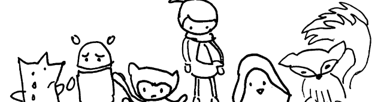]

- Rails Girls Poland - web site
- working groups
- next edition

- Rails Girls Summer of Code
- internship
- self-study
- help us

---

class: inverse

# Summary

.left-column[
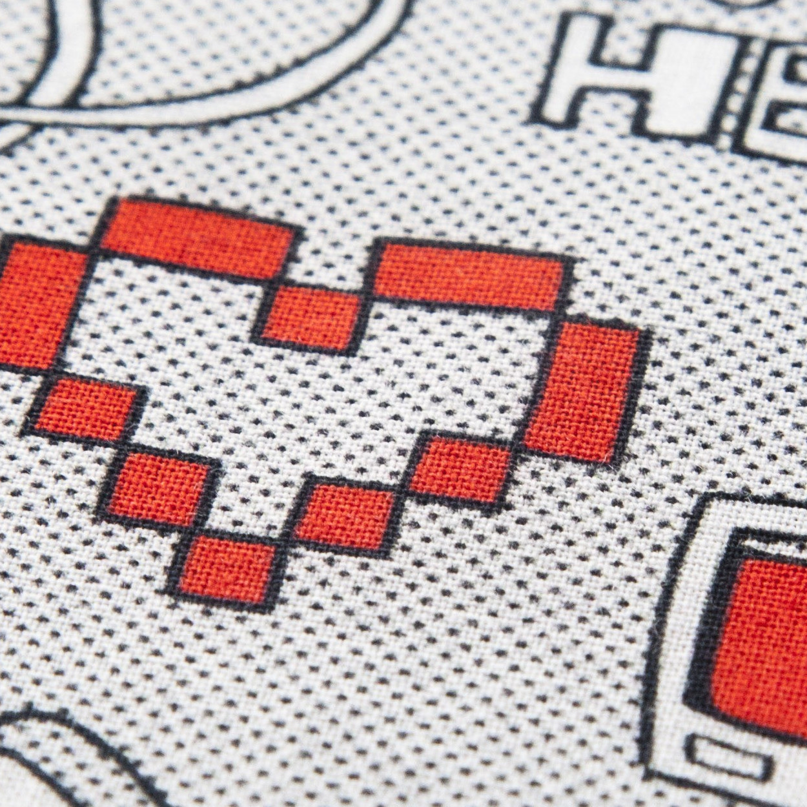
]

.right-column[
- a lot of positive energy
- a lot of positive people
- new friends
- great fun
- satisfaction
- hard working
- new knowledge
- share the passion
- team working
- a lot of wine ;)
]

---

# Links

- [Rails Girls](http://railsgirls.com)
- [Rails Girls Summer of Code](http://railsgirlssummerofcode.org/)
- [Rails Girls Silesia](http://railsgirls.com/silesia)
- [Rails Girls Silesia funpage](https://www.facebook.com/RailsGirlsSilesia)
- [FridayHug](http://fridayhug.com/)

---

class: middle, center

.small-image[]
### Agnieszka Matysek
[@womanonrails](https://twitter.com/womanonrails)

amatysek@fractalsoft.org
